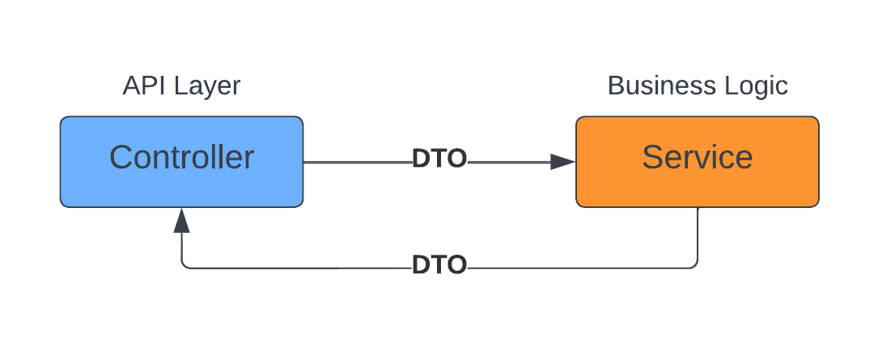

# spring-boot-helper-project

This is the helper project of the course: "**Spring Boot, ORM(JPA, Hibernate)**"

Course link: https://github.com/atique7465/spring-boot-orm-hibernate-jpa-course

**Branch Name:** _hp/student-info-manage_
1. In this branch a simple CRUD operations is done to manage student info.
2. Only 2 layer architecture is used. [Controller --> Service]

3. An in-class HashMap is used in service layer to act as database.