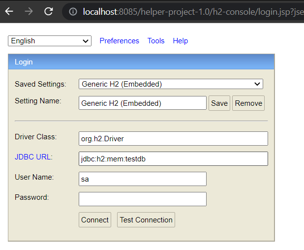
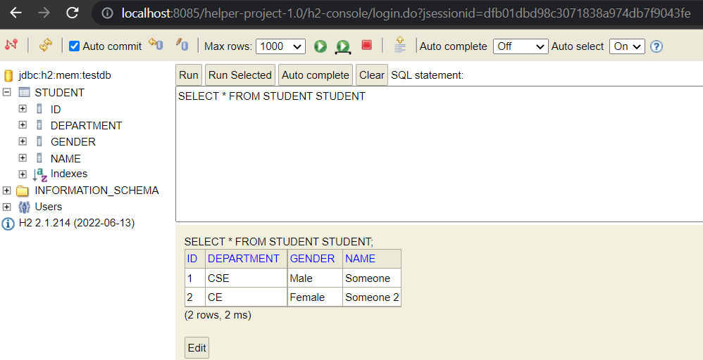

# spring-boot-helper-project

This is the helper project of the course: "**Spring Boot, ORM(JPA, Hibernate)**"

Course link: https://github.com/atique7465/spring-boot-orm-hibernate-jpa-course

**Branch Name:** _hp/student-info-manage-h2-jpa_
1. In this branch simple CRUD operations is done to manage student info.
2. 4 layer architecture is used. [Controller --> Service --> Dao --> Database]

3. H2 Database and JPA is used.
4. Run the Application
5. hit the url : http://localhost:8085/helper-project-1.0/h2-console
6. Below console will be displayed on browser:

7. Press the **Connect** button and see your database like:
