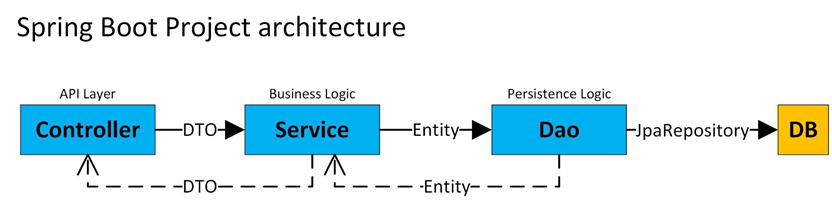
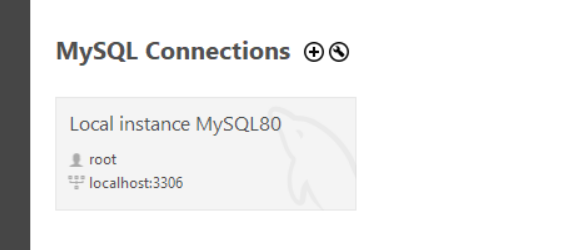
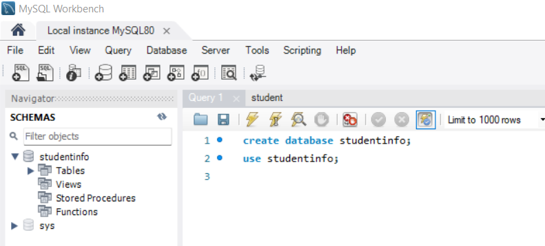
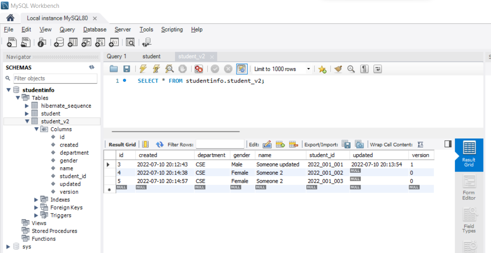

# spring-boot-helper-project

This is the helper project of the course: "**Spring Boot, ORM(JPA, Hibernate)**"

Course link: https://github.com/atique7465/spring-boot-orm-hibernate-jpa-course

**Branch Name:** _hp/student-info-manage-mysql-jpa-part-02_
1. In this branch simple CRUD operations is done to manage student info.
2. 4 layer architecture is used. [Controller --> Service --> Dao --> Database]

3. MySQL Database and JPA is used.
4. DB configuration already done in **_application.properties_** file.
5. MySQL driver dependency added in **_build.gradle_** file.
6. Log in to the **"root"** user in MySQL Workbench.

7. _Skip this step if already executed in task 04 part 01_. Create **"studentinfo"** database in MySQL Workbench query console (query kept in **_/dbconfig/v1_create_studentinfo_scheme.sql_** file). **"studentinfo"** database will appear in left side Navigation panel. Press refresh button in case database not appear. 

8. Run the Application, it will automatically create required tables in **"studentinfo"** database.
9. Hit **_POST localhost:8085/helper-project-1.0/api/v1/student_** with proper request, see data in student table.

10. Postman collection kept in "/documents" directory.